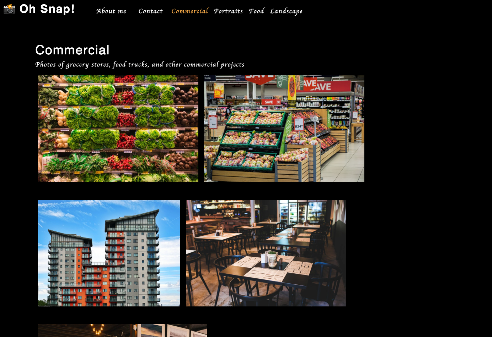

# Photo Port

This is a web application built using React that showcases a photographer's portfolio of photos and provides a contact form for visitors to contact them.

The application is deployed here: https://stevtm.github.io/photo-port/#about

## Screenshot

Here is a screenshot of the deployed application!

## References

- React: https://reactjs.org/
